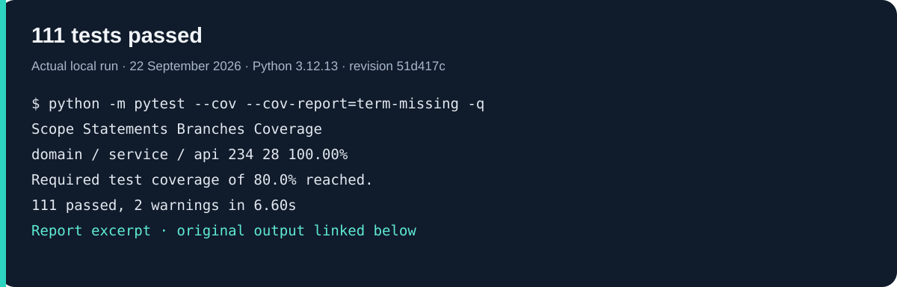
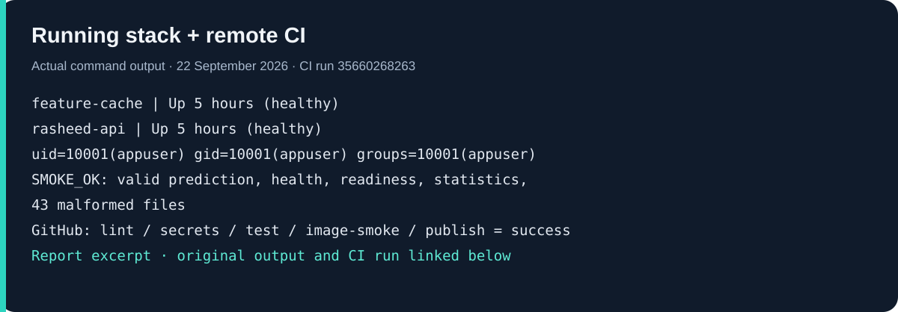
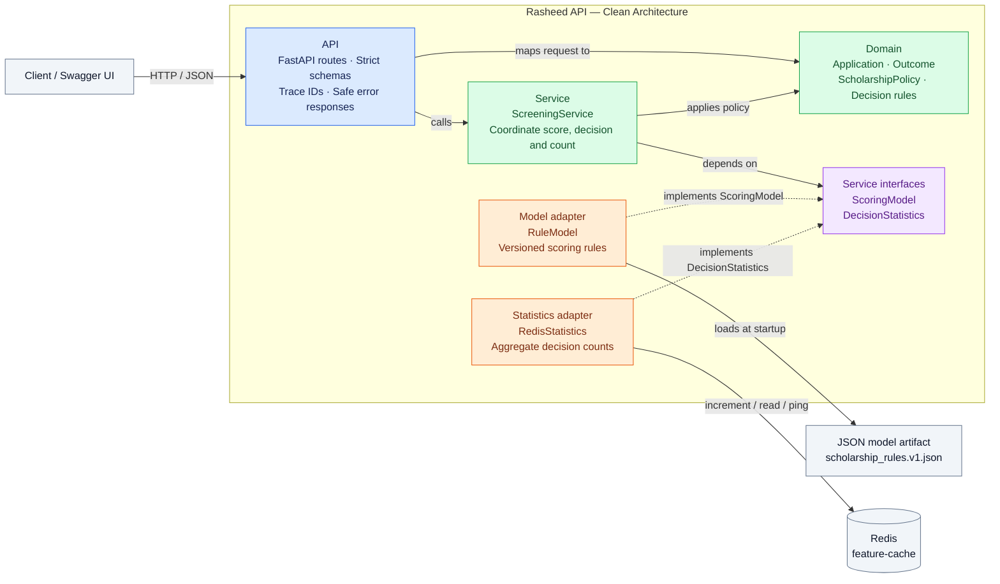

# Rasheed | راشد

My SDA-AIE-113 capstone project: a scholarship-screening API that gives an
applicant a clear result and explains what to do next.

[](https://github.com/Nasser-Alsuduni0/rasheed-capstone/actions/workflows/ci.yml)

Rasheed takes GPA, household income, household size, and two document-completeness
flags. It returns **accept**, **review**, or **reject**, along with the score,
reasons, and next steps. For example, a strong application with missing income
proof goes to review instead of receiving a final decision.

The focus of this project is the whole service: clear business rules, strict input
validation, useful explanations, tests, Docker, and a working delivery pipeline.
The scoring rules are deliberately small and inspectable. This is **not a trained
ML model**, and the sample policy is not an official scholarship standard.

[CI](https://github.com/Nasser-Alsuduni0/rasheed-capstone/actions/workflows/ci.yml) ·
[Decisions](DECISIONS.md) · [Measured benchmarks](BENCHMARKS.md) ·
[Five-minute demo](DEMO.md) · [Acceptance checklist](ACCEPTANCE.md)

The [verified initial release](RELEASE.md) includes a green CI run, full-SHA image
tag, and registry digest; its image was successfully pulled without credentials.

## Test evidence

These are rendered excerpts of real command output, **not terminal screenshots**.
The text reports are included so the results can be checked rather than relying
on an image. The local checks were rerun on 22 September 2026 against application
revision `51d417c`; timings are observations, not guarantees.



[Read the captured test report](docs/evidence/tests.txt). Coverage is for
`domain`, `service`, and `api`, not every file in the repository. The two warnings
are upstream Starlette/httpx and AnyIO deprecations; they are retained in the report.



[Read the runtime and CI output](docs/evidence/runtime-and-ci.txt) ·
[Inspect the green GitHub Actions run](https://github.com/Nasser-Alsuduni0/rasheed-capstone/actions/runs/35660268263)

The tests cover three levels:

- **Unit:** score thresholds, domain validation, configuration, and adapter behavior.
- **Integration:** the real HTTP interface with fake dependencies, including safe
  errors and all 43 malformed payload files.
- **Behavioural:** the real versioned scoring artifact, full golden decisions,
  and checks that income/GPA changes move results in the expected direction.

The Docker checks also exercise the actual Redis service. If Redis stops,
liveness stays at 200 while readiness returns 503. Shutdown must finish cleanup,
and the API must run as `appuser`, not root.

For build time, image size, startup time, and load-test measurements, see
[BENCHMARKS.md](BENCHMARKS.md). To repeat the checks, follow the
[developer workflow](#developer-workflow) below.

## Run it locally

Prerequisites: Git and running Docker Desktop with Linux containers and Compose v2.
The first run downloads images and packages; network speed affects elapsed time.
No Python installation, API key, or external AI service is needed to start the stack.

```sh
git clone https://github.com/Nasser-Alsuduni0/rasheed-capstone.git
cd rasheed-capstone
docker compose up --build --detach --wait
docker compose ps
```

Both `rasheed-api` and `feature-cache` should be healthy.
Open http://localhost:8010/docs for the interactive API.
The host port is 8010 so this project can coexist with the earlier fraud-service labs.
Redis is not exposed to the host.

On PowerShell:

```powershell
Invoke-RestMethod http://localhost:8010/v1/predict -Method Post -ContentType application/json -InFile payloads/valid.json | ConvertTo-Json -Depth 6
```

On Bash:

```sh
curl -s http://localhost:8010/v1/predict -H 'Content-Type: application/json' --data-binary @payloads/valid.json
```

The example returns `accept`, score `0.84875`, model version
`rasheed-rules-1.0.0`, and a unique trace ID. For a committee-review example,
change `income_proof_present` to `false` in Swagger's Try it out editor.
Stop with `docker compose down`; aggregate counters are intentionally ephemeral.

## Contract and policy

POST `/v1/predict` requires exactly these fields:

| Field | Type and permitted values |
| --- | --- |
| gpa | JSON number, 0–4 |
| monthly_household_income_sar | JSON number, 0–1,000,000 |
| household_size | JSON integer, 1–20 |
| transcript_present | JSON boolean |
| income_proof_present | JSON boolean |

Strings are not coerced to numbers/booleans; unknown fields, nulls, NaN,
and infinity are rejected. No names, national IDs, or document files are accepted.
The document flags are declarations, not document verification.

The score is `0.65 × GPA/4 + 0.35 × (1 − min(income/person/5000, 1))`.
Rules run in this order: missing documents → review; GPA below 2 → reject;
score at least 0.70 → accept; score at least 0.45 → review; otherwise reject.
The score is an eligibility index, **not a probability of success**.
See the [model card](models/MODEL_CARD.md) for assumptions and limitations.

Every prediction success/error uses `{data, error, trace_id}`.
Errors use safe codes: 422 `INVALID_REQUEST`, 503 `NOT_READY`, or
500 `INTERNAL_ERROR`, without request values or internal exception names.
The response header `X-Trace-Id` matches the body and JSON request log.

| Endpoint | Purpose |
| --- | --- |
| GET /health or /v1/health | Process liveness; no Redis/model work |
| GET /ready or /v1/ready | Startup complete and Redis reachable |
| POST /v1/predict | Score and explain one application |
| GET /v1/statistics | Aggregate accept/review/reject request counts |
| GET /docs | Interactive OpenAPI documentation |

The tested extension adds reason codes, missing-document lists, and next steps.
Statistics count successful scoring calls, including repeated calls and smoke/load
tests—not unique students. There is no applicant database or idempotency promise.

## Architecture

The API handles HTTP, the service coordinates screening, and the domain owns the
scholarship rules. Model loading and Redis access stay in adapters, behind Python
Protocols, so the business logic does not depend on either implementation.



Solid arrows show calls, dependencies, or resource access. Dashed arrows show
which Protocol each adapter implements; the service does **not** import the
concrete adapters. Responses return through the API in the same
`{data, error, trace_id}` envelope.

| Layer | Responsibility | Code |
| --- | --- | --- |
| API | Validate requests, map them to domain objects, and format responses | [api/](src/rasheed/api/) |
| Service | Coordinate scoring, policy evaluation, and statistics through Protocols | [service/](src/rasheed/service/) |
| Domain | Define application data, decision thresholds, reasons, and next steps | [domain/](src/rasheed/domain/) |
| Adapters | Load the scoring artifact and communicate with Redis | [adapters/](src/rasheed/adapters/) |

**Startup and shutdown.** [bootstrap.py](src/rasheed/bootstrap.py) wires the
concrete adapters into the service. Importing it performs no model load or network
connection. FastAPI's lifespan loads settings and the model, warms the service up,
checks Redis, and only then exposes readiness. Shutdown closes the Redis client.

**Keeping the boundaries intact.** Domain code has no framework imports, and HTTP
schemas do not become domain entities. Four import-linter contracts enforce the
layer boundaries. Integration tests swap in fake adapters; behavioural tests use
the real scoring artifact.

## Developer workflow

Use Python 3.12 (the version exercised in CI). Windows PowerShell:

```powershell
py -3.12 -m venv .venv
.\.venv\Scripts\Activate.ps1
python -m pip install --require-hashes -r requirements-dev.lock
python -m pip install --no-deps -e .
python scripts/fast_gate.py
python -m pytest -m slow -q
python -m pytest --cov --cov-report=term-missing -q
ruff check src tests scripts
ruff format --check src tests scripts
mypy src
lint-imports
```

On Linux/macOS, use `python3.12 -m venv .venv` and
`source .venv/bin/activate`, then `make install lint test`.

| Make target | Action |
| --- | --- |
| install | Hash-verified dev dependencies and editable package |
| lint | Ruff, formatting, strict mypy, architecture contracts |
| test | All three test levels with branch coverage gate ≥80% |
| test-fast / test-slow | ≤60-second fast gate / real-model behavioural suite |
| image / up / down | Build / start healthy stack / stop stack |
| smoke | Valid prediction, health/readiness/statistics, all 43 malformed files |
| benchmark | 1,000 requests at concurrency 10 |
| secrets | Gitleaks history and working-tree scans |

Smoke/benchmark scripts need only the Python standard library and a running stack.
`python scripts/operations_check.py` deliberately stops Redis and the API to
verify recovery and cleanup; afterwards run `docker compose up -d --wait`.
`python scripts/startup_time.py` recreates only this project's API for timing.
These operational scripts assume the default port 8010.

Golden decisions are hand-reviewed specifications, not snapshots regenerated from
current output. The session-scoped `real_model` fixture loads the real artifact
once. Changing the model requires deliberate version, model-card, and golden
review; see [golden provenance](tests/golden/README.md).

## Configuration, privacy, and deployment

All application environment settings live in `rasheed.config.Settings`:
`RASHEED_MODEL_PATH`, `RASHEED_REDIS_URL`, `RASHEED_REDIS_TIMEOUT_SECONDS`,
and `RASHEED_LOG_LEVEL`. See [.env.example](.env.example).
Invalid settings/artifacts fail startup. Secrets are not committed.
Compose uses environment variables directly; copy no real secrets into examples.

The image runs as `appuser` (UID 10001), with a read-only root filesystem,
dropped capabilities, one worker, and a `/ready` healthcheck. API/Redis memory
limits are 256/128 MB. One worker is sufficient for this tiny artifact; a future
large model needs memory measured per worker before increasing concurrency.
JSON application logs go to stdout and contain no applicant inputs.
This local demonstration has no authentication, TLS, rate limiting, or durable
audit log; those controls and an approved fairness/privacy review are prerequisites
for handling real applicants. Do not expose the demo directly to the internet.

CI runs lint and a full-history secret scan, fast/slow tests, then real Docker
smoke, size, outage, and shutdown checks. Only main pushes publish the **same
tested image**, tagged with the full Git commit SHA. Pull requests never publish.
After initial repository bootstrap, protected main requires a reviewed PR,
one approval, and passing lint/secrets/test/image-smoke checks; force pushes are
disabled. A repository owner cannot approve their own PR.

For a release, copy the full SHA-tagged image reference from the successful
Actions publish summary. On PowerShell:

```powershell
$env:RASHEED_IMAGE = "ghcr.io/nasser-alsuduni0/rasheed-capstone:FULL_COMMIT_SHA"
docker compose pull
docker compose up --detach --no-build --wait
```

Replace `FULL_COMMIT_SHA` with an actually published revision; never use
`latest`. A SHA tag identifies a revision; for stronger registry immutability,
deploy its `@sha256:...` digest. Roll back by selecting a previously verified
SHA/digest and rerunning the same commands.

## Troubleshooting

- Docker unavailable: start Docker Desktop and select Linux containers.
- Port busy: set `RASHEED_PORT` before Compose, then pass the new base URL
  to smoke/benchmark; operational timing/failure scripts use the default port.
- Unhealthy API: inspect `docker compose logs rasheed-api` and Redis health;
  missing model/invalid configuration stops startup rather than serving defaults.
- Redis unavailable: liveness remains 200, readiness/predictions return safe 503.
- Stop exit 143: normal SIGTERM behavior for the pinned Uvicorn version **after**
  lifespan cleanup; operational checks require `service_stopped` and no OOM.
  Exit 137 is not normal—investigate memory limits.
- Golden test failure: inspect the policy change; do not blindly rewrite expected files.

## Acknowledgments

This project was completed as part of the SDA-AIE-113 — Software Engineering Practices for AI Systems training program at SDAIA Academy, under the supervision of Abdullah Khalid AlShahrani.

The portfolio demonstrates the practical application of software engineering practices for AI systems — building a production-style AI/ML service through clean architecture, a well-defined API contract, containerization, a layered automated testing suite, a CI/CD pipeline with branch protection, and safe configuration, secrets, and logging management.

Official SDAIA Academy GitHub:
[https://github.com/SDAIAAcademy](https://github.com/SDAIAAcademy)
